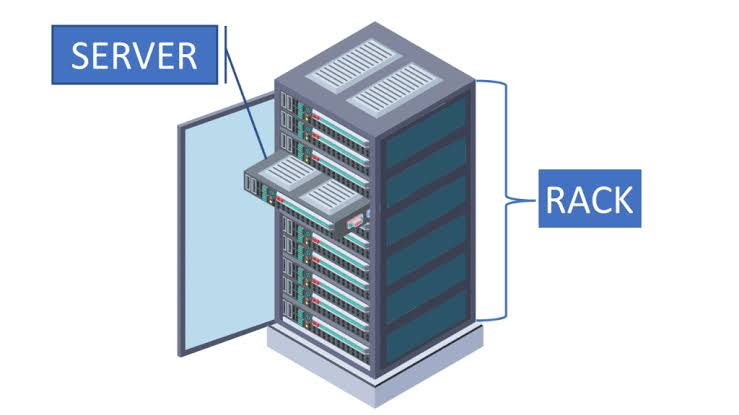
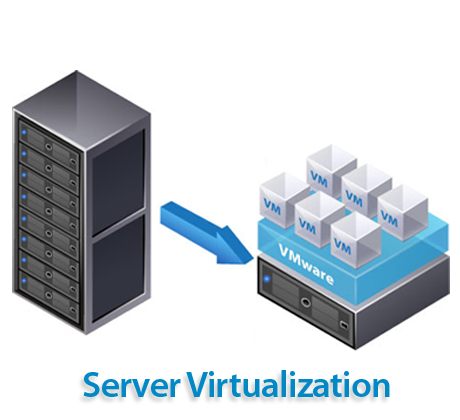
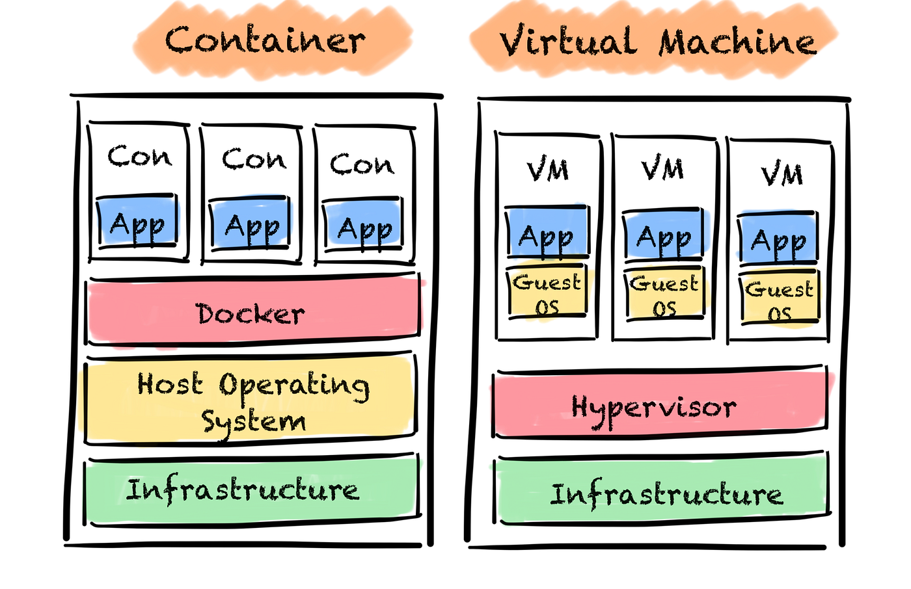

# 00 - Understanding the Layers Before Docker

When I started learning Docker, I could run commands like:

```bash
docker run hello-world
```

and everything worked.

But I still had one confusion.

> What exactly is Docker running on?

To answer that, I started from the bottom and built everything myself in AWS.

---

## It All Starts With a Physical Machine

Somewhere inside an AWS datacenter, there is a real server.(datacenters owned by many companies like Azure,GCP,etc. Here, I use AWS server)


Something like:

```text
Physical Server

CPU  : 64 Cores
RAM  : 256 GB
Disk : 4 TB
```

This is an actual machine owned by AWS.

```text
+----------------------+
| Physical Server      |
|                      |
| CPU                  |
| RAM                  |
| Disk                 |
+----------------------+
```

One customer cannot use the entire machine.

AWS has thousands of customers.

So AWS needs a way to divide this machine safely.

---

## Virtual Machines

Instead of giving the whole server to one customer, AWS splits it into multiple virtual machines.


```text
Physical Server
        |
    Hypervisor => make logical seperations & maintains  eg:VMware    |
--------------------------------
|              |              |
VM-1          VM-2          VM-3
```

Example:

```text
VM-1 -> My EC2
VM-2 -> Another Company
VM-3 -> Another Customer
```

Each VM behaves like a completely separate computer.

Even though all of them are running on the same physical server.

This is the idea behind virtualization.

---

## What Happens When I Create an EC2?

When I launched:

```text
Ubuntu EC2
```

I was not getting a new physical server.

AWS simply created a Virtual Machine for me.

Something like:

```text
Physical Server
        |
    Hypervisor
        |
--------------------------------
|              |              |
My EC2       Customer B     Customer C
```

Suppose the physical server has:

```text
256 GB RAM
```

AWS may allocate:

```text
My EC2 = 8 GB RAM
```

Now that 8 GB belongs to my virtual machine.

Inside that VM, Ubuntu runs normally.

```text
My EC2
│
├── Ubuntu OS
├── SSH
├── System Services
└── Applications
```

At this point I basically own a Linux server.

---

## Accessing the Server

After creating the EC2 instance, AWS gave me:

```text
Public IP
Key Pair (.pem)
```

Using SSH:

```bash
ssh -i key.pem ubuntu@public-ip
```

I connected from my laptop.

Architecture:

```text
My Laptop
      |
     SSH
      |
      v
Ubuntu EC2
```

Now every command runs on the EC2 server instead of my local machine.

---

## Why Not Just Use Virtual Machines For Everything?

Initially this sounds perfect.

Every application can get its own VM.

Example:

```text
VM-1 -> Spring Boot
VM-2 -> PostgreSQL
VM-3 -> Redis
```

But then I realized something.

Every VM contains a full operating system.

```text
VM-1
 └── Ubuntu

VM-2
 └── Ubuntu

VM-3
 └── Ubuntu
```

Three applications.

Three operating systems.

Suppose:

```text
Ubuntu OS = 1 GB RAM
```

Then:

```text
VM-1 Ubuntu = 1 GB
VM-2 Ubuntu = 1 GB
VM-3 Ubuntu = 1 GB

Total OS Cost = 3 GB
```

before the applications even start.

That feels expensive.

---

## The Observation That Led To Containers

Imagine I have a simple Python application.

```python
print("Hello Susi")
```

Do I really need:

```text
Ubuntu
Boot Process
System Services
Drivers
Package Manager
```

every single time just to run one small application?

Not really.

Most of the operating system is not even being used by the application.

This is where containers come in.

---

## Containers


Instead of creating a full operating system for every application, containers share the operating system.


```text
Ubuntu OS
      |
--------------------------------
|              |              |
Container 1   Container 2   Container 3
```

Example:

```text
Container 1 -> Spring Boot
Container 2 -> PostgreSQL
Container 3 -> Redis
```

Now there is:

```text
One Ubuntu OS
```

instead of:

```text
Three Ubuntu OS
```

This saves memory and storage.

Containers also start much faster.

---

## The Most Important Difference

A VM contains its own operating system.

```text
VM
│
├── Ubuntu
└── Application
```

A container does not.

```text
Container
│
└── Application
```

The container uses the operating system that already exists on the host machine.

That is why containers are lightweight.

---

## My Mental Model

This is the model that finally made sense to me.

```text
Physical Server
        |
    Virtual Machine (EC2)
        |
      Ubuntu
        |
    Containers
        |
    Applications
```

Every layer exists because it solves a problem.

```text
Physical Server
      |
      | Need sharing
      v
Virtual Machines
      |
      | Too heavy
      v
Containers
```

---

## Where I Am Right Now

After completing the AWS setup, this is my current architecture.

```text
My Laptop
      |
     SSH
      |
      v
AWS EC2 (Virtual Machine)
      |
Ubuntu OS
```

I now understand:

* What a Physical Server is
* What a Virtual Machine is
* Why EC2 is a VM
* Why VMs became popular
* Why containers were introduced

The next question is:

> How do containers actually get created and managed?

That's where Docker enters the picture.
